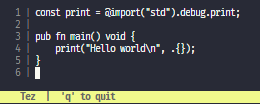

# Tez ⚡️

### Lightweight text editor written in Zig

Sample of what the editor looks like now. It is very barebones as of now.



## Reality

This is just a project to learn Zig more indepth. The goal is to build a simple but well working TUI editor to edit files quickly.

As of now, there's not really any functionality. It allows for some text to be written, but there's no support to open, edit or even save any files yet.

## Local Development

Project was built using [Zig v0.12.0](https://github.com/ziglang/zig). For local development execute:

```sh
zig build run
```

### Nix

Alternatively you can also use Nix:

```sh
nix develop github:markbeep/Tez # get required development tools
nix run github:markbeep/Tez # directly runs the editor
```

_Note, leave out the `github:markbeep/Tez` when you want to run the local version._
