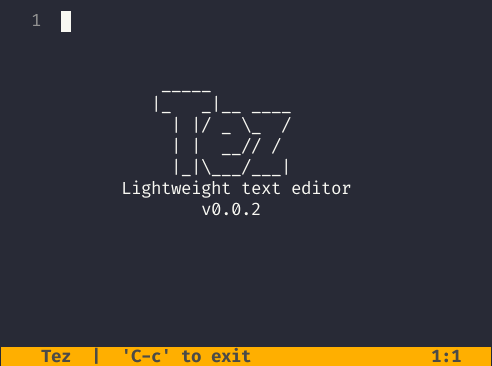

# Tez ⚡️


### Lightweight text editor written in Zig

Tez is a side project to learn Zig better while also making a lightweight and usable editor.



## Usage

*Note:* The rewrite was halted early because of time reasons. Now the editor doesn't really allow editing anymore. Ironic for an editor.

Tez currently has limited functionality. You can open and edit files as of now. There's no LSP, syntax highlighting or
proper error handling as of now. If you try to create a file in a non-existent directory it will crash when you try to save
as of now. Additionally, if you open Tez without specifying a file, you can't open a new file buffer yet.

```sh
tez sample.txt
```

## Keybinds
The editor is non-modal as of now. Keybinds are a mix of useful VIM and VSC keybinds.
Movement is done with the arrow keys (sorry VIM diehards).

Non-exhaustive list of current keybinds:

- HOME: Jump to start of line
- END: Jump to end of line
- CTRL-S: Save file
- CTRL-C: Close file (without saving)
- CTRL-D: Jump down half a page
- CTRL-U: Jump up half a page

You can also just open the editor by using `tez` on its own. Currently there's no way to save
what written to a file if Tez is opened without a path.

## Local Development

Project was built using [Zig v0.12.0](https://github.com/ziglang/zig). For local development execute:

```sh
zig build run
```

### Nix

Flake allows for you to develop locally with `nix develop`.

